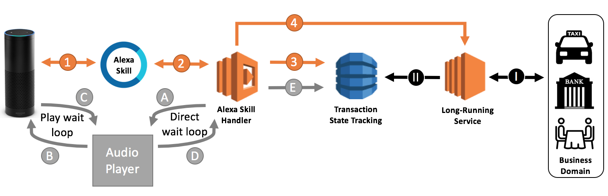

# Wait-Loop Design-Pattern for Alexa Skills

__This template demonstrates how to leverage Alexa's Audioplayer-interface for skills to create a wait-loop with music and (AWS Polly) voice status updates in order to support asynchronous processing of longrunning transactions without disconnecting from the user on an Alexa-enabled device.__



Dialog interaction with your users in Alexa skills are synchronous. Requests from users have to be processed in your Alexa skill within 8 seconds before Alexa times out and closes the session. For most use cases this is fine, but for others its problematic. Long-running processes like booking orders and transactions might take longer than 8 seconds. The only way to tackle this problem is to ask users to come back to your skill and ask for status. However, you might want to stay connected with the user and to provide continuous status updates while processing asynchronous transactions in your backend. 

__This implementation is not safe for certification.__ Use it but extend it with implementations for all required intents.

## How it works

An example. Assume you built a skill to book a taxi. Your backend service reaches out to a bunch of service providers (e.g. taxi-drivers) to fullfil the request. It's unpredictable how long it takes to get response. 

__User:__ _"Alexa, tell Taximate to get me a ride."_

__Alexa__ "Ok, please hold on. I am looking for a driver near you".
_Wait loop music starts playing for 15 seconds_

__Alexa*:__ _"Your request is still being processed. Thank you for your patience"_
_Wait loop music starts playing for another 15 seconds_

__Alexa*:__ "Your request is still being processed. Thank you for your patience"
_Wait loop music starts playing for another 15 seconds_

__Alexa*:__ "I found a driver. He will be at your home in 10 minutes." 

__*__ Actually it is not Alexa speaking here. There's a voice recording played back (i.e. from AWS Polly).

## The Solution

The solution consists of the following components:
- An Alexa skill implementing the AudioPlayer
- A Dynamo-table that keeps track of transaction status
- A backend-domain that is processing the transaction

This template consists of the following artifacts:
- A Lambda function for the skill
- Some MP3-files (one with a short wait-loop music sample, a few others with recorded voices telling a user that the transaction is still running, canceled, completed or exceeded). The voice recordings in this example are coming from AWS Polly. Feel free to use your own.
- No Backend-service. You need your own. This templates is just simulating it.

Please follow above illustration to understand how it works

1) A voice request invokes your skill and triggers a transaction (i.e. "get me a ride")
2) An intent handler is triggered in the Lambda function.
3) The Lambda function creates a record for the transaction in Dynamo-DB. It sets a generated unique transaction-Id as the key and an integer value (default: 0) to indicate transaction progress.
4) The Lambda function then kicks off the long-running transaction in the backend without waiting for a response. This is an asynchronous call. You could also let your backend respond with its own transaction-Id. Instead of generating one in your Lambda (step 3), you can use this identifer and create a record with it in Dynamo.

__A)__ The skill responds to the synchronous call of Alexa in a very short time as this call is decoupled from the actual processing in the backend. It responds with an output-speech (saying something like: "I am now looking for a driver, please hold on") and with a PlayDirective for the AudioPlayer. The directive gets the transactionId as the token.

__B)__ An MP3 starts playing on the user's device. This templates uses the Jeopardy-sound with a play-length of 15 seconds. 

__C)__ AudioPlayer indicates the nearing end of the music's playback.

__D)__ The PlayBackNearlyFinished-event is sent to the skill. 

__E)__ As it comes with a token containing the transaction-Id, the Lambda is able to look up the corresponding Dynamo-record and check for the current status of the backend-transaction. 

__Start over with A)__ If the transaction didn't complete yet, it returns to AudioPlayer with another MP3-file - this time it is the recorded voice asking the user to hold on and wait a bit longer. Next time it will be the wait-loop music again. 

It is looping A to E until one of the following events:
- __the transaction is completed__: the Lambda returns to AudioPlayer with an MP3 (recorded voice to tell the user that the transaction is complete)
- __the transaction is cancelled by the user__: the Lambda receives the Pause-Intent in case a user decided to not wait any longer ("Alexa, stop"). The Lambda function will tell the backend to stop processing the transaction and returns with a cancellation-message to the user.
- __the transaction took too long__. You can configure in this template how many loops (A to E) you want users to wait for completion. If it exceedes that limit the Lambda returns to AudioPlayer with an MP3 (recorded voice tells users that the transaction timed out). There's no particular limit - you can decide to loop for several hours even though I don't think users will love your for that.

__I)__ Right after the Lambda triggered the transaction in the backend, the service starts to work on it. 

__II)__ The long-running process indicates progress and final completion of the transaction by writing to the corresponding record in Dynamo-DB. As you learned, the Lambda function reads from it.


## How to Run the Sample

1. Clone the project and package the skill:
```bash
git clone https://github.com/KayLerch/alexa-wait-loop-player
cd alexa-wait-loop-player/js
npm install
zip -r ../alexa-wait-loop-player.zip *
```
2. Follow the "How to Run" instructions in https://github.com/alexa/skill-sample-nodejs-audio-player to set up a Lambda function and upload the ZIP-file you got from step 1).

3. Upload the MP3s in the _audio_-folder of this repository to S3 or another secured web-storage and change to URLs in the _js/constants.js_ file accordingly. 
     
4. Use the _speechAssets/IntentSchema_ to create an Alexa skill in the Amazon developer portal that implemens the AudioPlayer interface. This sample skill doesn't need any sample utterances as the transaction is started with a LaunchRequest. If the console insists on getting sample utterances from your, simply extend one of the builtin-intents (i.e. AMAZON.HelpIntent help me please)

## How to Extend the Sample
Have a look at _/js/transactions.js_ file. It is the skeleton for your custom logic to access your backend. Basically, you don't need to change code in any other file except this one to make the skill work with your transactional backend. Feel free to use your own voice recordings and link to them in the _/js/constants.js_ file. If you don't want to have static responses you could even think about generating TTS files on the fly by calling AWS Polly. This however needs some changes in the _/js/audioEventHandlers.js_ file.

You can learn more about the new [AudioPlayer interface](https://developer.amazon.com/public/solutions/alexa/alexa-skills-kit/docs/custom-audioplayer-interface-reference) and [PlaybackController interface](https://developer.amazon.com/public/solutions/alexa/alexa-skills-kit/docs/custom-playbackcontroller-interface-reference).
